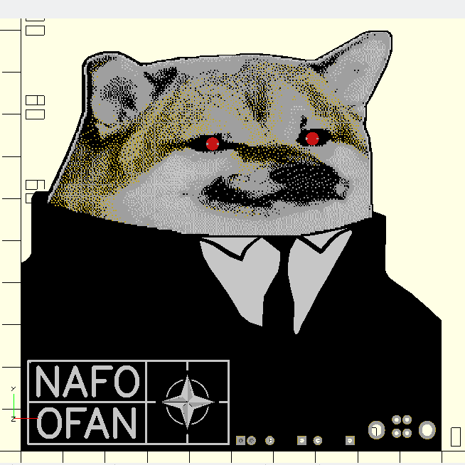
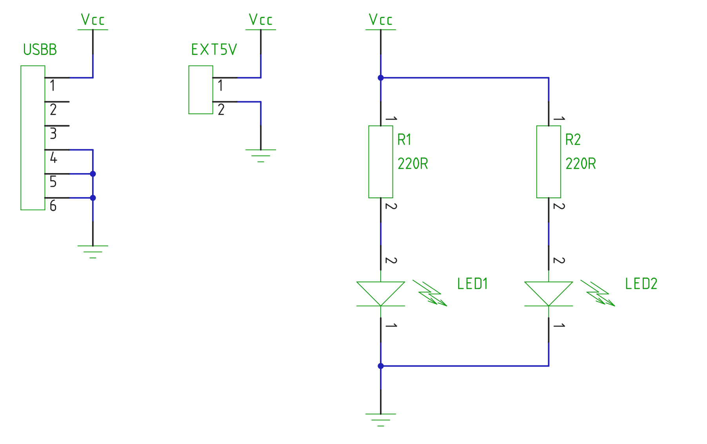

# STEM4ukraine-NAFO-Alpha

"You pronounced this nonsense, not me"

Build this simple project to express your non negotiable alignment with the articles of NAFO.

A simple and fun school STEM project demonstrating simple through hole soldering and analogue electronics using USB to power the circuit.

The circuit is very simple, using resistors and USB power to drive the NAFO Fella's eyes.

A perfect decoration for your desk, bedside table or home. 

The prototype is currently undergoing manufacturing and testing

An openscad render of the front of the PCB:

The circuit schematic, using some current limiting resistors for the rear mounted 3mm LEDs:

The gerbers and dithered graphics assume black soldermask, white silkscreen, and Pb/Sn pads, on a fibreglass FR4 substrate.
